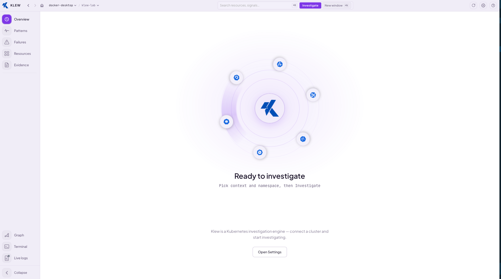
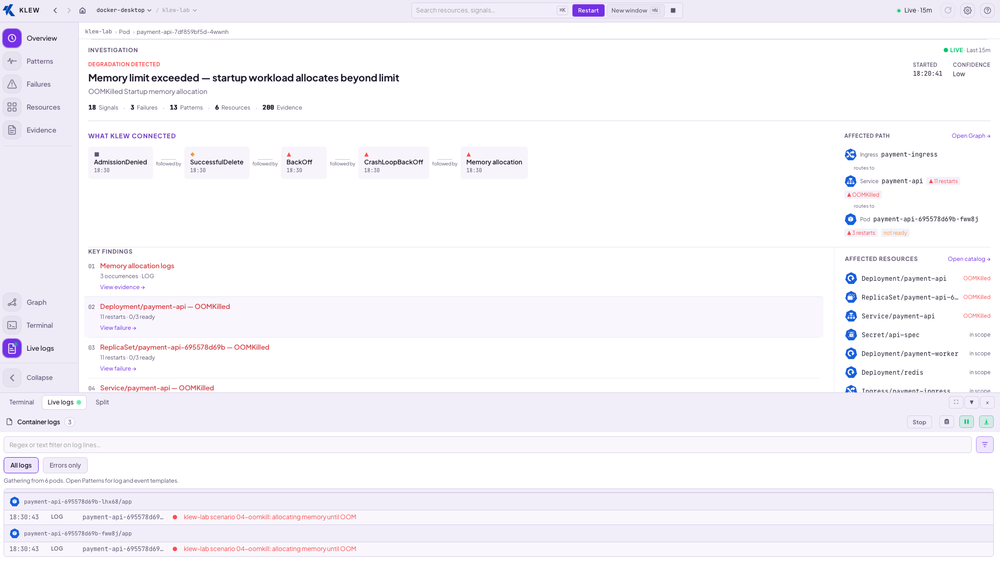
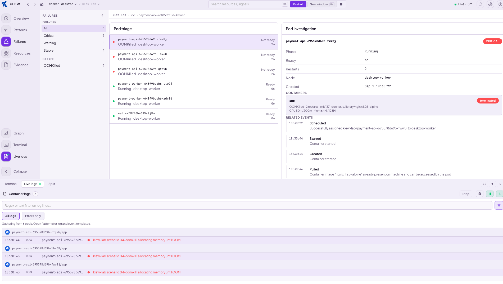
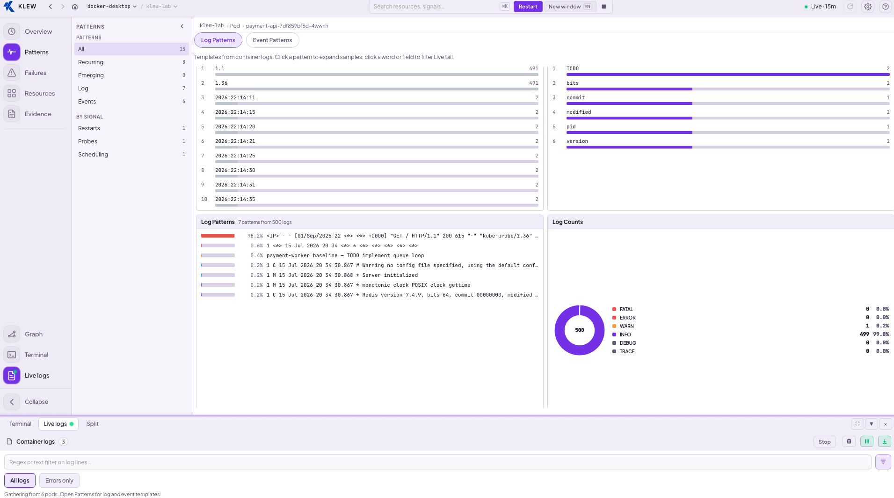
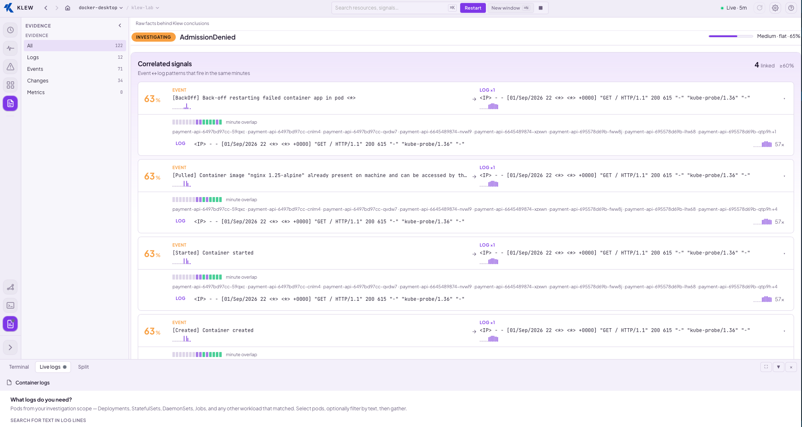
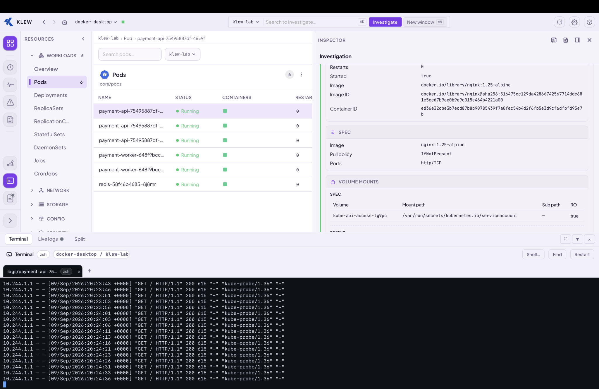
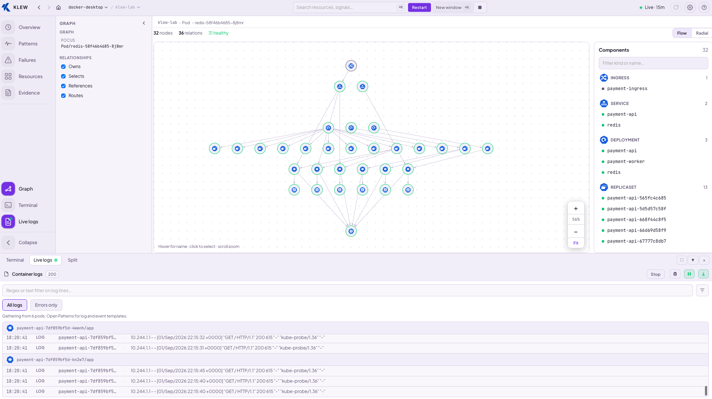

# Klew

Live Kubernetes incident investigation for macOS.

When something breaks in a cluster, you need to answer three questions quickly: **what failed**, **why it failed**, and **what else is affected**. Klew discovers related objects, watches live state and events, correlates logs and infrastructure signals, and keeps a single investigation updated as the cluster changes.

Built for engineers on call, SREs, and platform teams who already use `kubectl` and want a focused workspace instead of stitching together commands across terminal tabs.

## Screenshots

| Welcome | Overview |
| --- | --- |
| Pick context, namespace, and start investigating. | Live brief — signals, chain, confidence, next steps. |
|  |  |

| Failures | Patterns |
| --- | --- |
| Ranked runtime failures in scope. | Log and event templates with correlated behavior. |
|  |  |

| Evidence | Resources |
| --- | --- |
| Correlated signals and supporting facts. | Catalog browse, inspector, and live logs in one workspace. |
|  |  |

| Graph |
| --- |
| Relationships across workloads, services, and ingress. |
|  |

## Install

**Requirements:** macOS 12+, a valid kubeconfig (`~/.kube/config` or `KUBECONFIG` from your shell profile).

### Download

Latest release: [github.com/glnreddy421/klew/releases](https://github.com/glnreddy421/klew/releases)

| Mac | File |
| --- | --- |
| Apple Silicon | `Klew-x.y.z-macos-arm64.dmg` |
| Intel | `Klew-x.y.z-macos-amd64.dmg` |

Open the DMG and drag **Klew** to Applications.

### Homebrew

Installs **Klew.app** to `/Applications` (standard macOS cask).

```bash
brew tap glnreddy421/klew
brew install --cask klew
```

**Upgrade** (after a new release):

```bash
brew update && brew upgrade --cask klew
```

**Uninstall:**

```bash
brew uninstall --cask klew
```

If you installed an older **formula** build (`brew install klew` without `--cask`), migrate once:

```bash
brew uninstall klew
brew install --cask klew
```

## Quick start

1. Launch Klew and select a **context** and **namespace**.
2. Search for a workload (optional) and click **Investigate**.
3. Move through Overview, Failures, Patterns, and Evidence as signals arrive.

**Namespace is the boundary.** Klew investigates workloads inside the selected namespace, not the namespace object itself.

## Surfaces

| Surface | Purpose |
| --- | --- |
| **Overview** | Status, leading signal, causal chain, and next steps |
| **Failures** | Concrete runtime failures ranked by severity |
| **Patterns** | Log and infrastructure event templates |
| **Evidence** | Correlated signals and supporting observations |
| **Resources** | Kubernetes catalog and entity detail |
| **Graph** | Relationships between affected resources |
| **Terminal** | Cluster shell for the active context |
| **Live logs** | Tail container logs from investigation pods |

## Keyboard shortcuts

| Shortcut | Action |
| --- | --- |
| ⌘K | Focus search |
| ⌘N | New window |
| ⌘R | Sync kubeconfig |
| ⌘\` | Terminal |
| ⌘⇧L | Live logs |

## Build from source

Requires Go 1.22+, Node 22+, and [Wails v2](https://wails.io).

```bash
git clone https://github.com/glnreddy421/klew.git
cd klew/cmd/klew-desktop
wails dev
```

Release builds use `.github/scripts/build-macos.sh`.

## License

Apache 2.0 — see [LICENSE](LICENSE).
